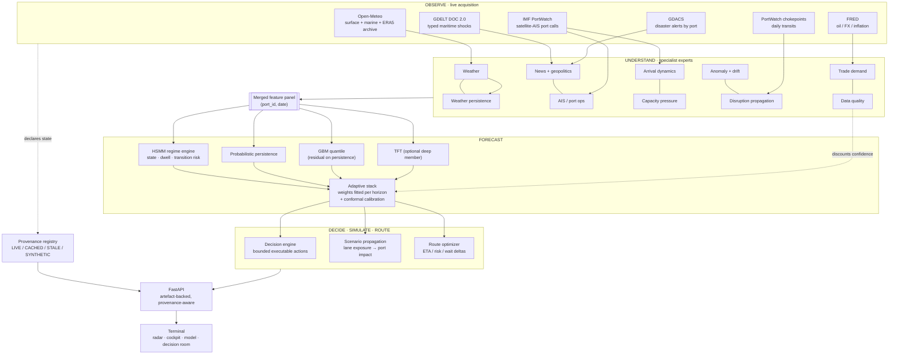

# India PortWatch

**Predictive maritime digital twin and autonomous operations intelligence for Indian ports.**

India PortWatch answers one question for a port operations desk, a shipping
line or a maritime agency:

> **Which port needs intervention right now, why, and what should we do about it?**

It observes real satellite-AIS port activity, live marine weather and global
maritime events; understands them through a bank of specialist experts;
forecasts congestion ten days ahead with calibrated uncertainty; simulates
shocks against that forecast; and turns the result into a specific, bounded,
measurable operational instruction.

```
OBSERVE  →  UNDERSTAND  →  FORECAST  →  SIMULATE  →  DECIDE  →  ROUTE
```

Every number the terminal displays is traceable to an artefact the pipeline
wrote. Where a measurement does not exist, the interface says `n/a`; where a
feed is stale, it says `STALE` and shows the age. That is a deliberate design
constraint, not a limitation — a control-room tool that quietly substitutes a
plausible number is worse than one that goes dark.

---

## Contents

- [What it does](#what-it-does)
- [Architecture](#architecture)
- [Data sources and provenance](#data-sources-and-provenance)
- [Models and accuracy](#models-and-accuracy)
- [Workspaces and screens](#workspaces-and-screens)
- [Run it](#run-it)
- [Deploy it](#deploy-it)
- [Tests and CI](#tests-and-ci)
- [Honest limitations](#honest-limitations)

---

## What it does

| Stage | What happens | Where it lives |
|---|---|---|
| **Observe** | Daily satellite-AIS port calls and trade tonnage per Indian port (IMF PortWatch); live surface + marine weather and a 10-day forecast per port (Open-Meteo); typed maritime shocks from GDELT and disaster alerts from GDACS; chokepoint transit counts for six global waterways | `src/ingestion/` |
| **Understand** | Ten specialist experts turn raw signals into bounded, leakage-safe features: weather, weather persistence, news/geopolitics, AIS port-ops, arrival dynamics, trade demand, macro, capacity pressure, anomaly detection, disruption propagation, and data quality | `src/experts/` |
| **Forecast** | An HSMM infers the operating regime and its expected dwell; a stacked ensemble of probabilistic persistence, a GBM quantile model and (optionally) a Temporal Fusion Transformer produces a 10-day q10/q50/q90 forecast with per-horizon conformal calibration | `src/regimes/`, `src/forecasting/` |
| **Simulate** | Ten typed shocks propagate through a measured lane-exposure graph onto specific ports, and the deltas are the difference between two forecasts the system actually produced | `src/decision/scenario_service.py` |
| **Decide** | A deterministic rule cascade issues a bounded, executable action with its target, horizon, ranked driver contributions, expected delay saved, fallback and uncertainty | `src/decision/decision_layer.py` |
| **Route** | The fleet optimizer scores each vessel's intended call against the best alternative and reports the ETA, risk and port-wait difference between them | `src/decision/route_optimizer.py` |

---

## Architecture



**One source of truth for ports.** `src/utils/port_registry.py` ties together
each port's model id, UN/LOCODE, IMF PortWatch feed id, geography and static
capacity attributes. The pipeline, the API and the terminal all resolve through
it, and legacy codes alias forward.

---

## Data sources and provenance

Every source declares its own state, and the state is enforced rather than
asserted: a feed that claims `LIVE` but whose newest observation is older than
its freshness budget is automatically downgraded to `STALE`.

| State | Meaning |
|---|---|
| `LIVE` | Fetched from the provider during this run, observation inside the budget |
| `CACHED_LIVE` | Real provider data replayed from the local cache, still fresh |
| `STALE` | Real provider data, past its freshness budget — usable at reduced confidence, labelled everywhere |
| `SYNTHETIC` | Modelled or generated stand-in. Never presented as measured |
| `UNAVAILABLE` | The source failed and no usable fallback exists |

| Source | Provider | Typical state | What it feeds |
|---|---|---|---|
| Port activity | IMF PortWatch (ArcGIS, keyless) | `CACHED_LIVE` → `STALE` | Congestion index, throughput, utilization, berth-wait proxy |
| Marine weather | Open-Meteo forecast + marine (keyless) | `LIVE` | Wind, gusts, precipitation, visibility, wave height, 10-day known-future covariate |
| Weather history | Open-Meteo ERA5 archive | `CACHED_LIVE` | Weather-aware training over the full port history |
| Maritime events | GDELT DOC 2.0 + GDACS | `CACHED_LIVE` | Port-attributed event risk, terminal event stream with source links |
| Chokepoint transits | IMF PortWatch daily chokepoints | `CACHED_LIVE` | Disruption propagation onto exposed ports |
| Macro conditions | FRED (Brent, USD/INR, CPI) | `LIVE` | Oil, FX and inflation stress in the regime model |
| Per-vessel AIS tracks | — | `UNAVAILABLE` | Not licensed here. The map shows daily port-call **aggregates** and says so |
| Sentinel-1 SAR detection | — | `UNAVAILABLE` | Not wired here. Reported as unavailable rather than drawn |

`GET /api/provenance` returns the full registry; `GET /api/health` returns the
summary the terminal renders on every screen.

---

## Models and accuracy

### Protocol

Expanding-window walk-forward over the same supervised frame for every
candidate. A training row is used only if its label was already observable at
the fold cutoff. The ensemble weighting policy is fitted **exclusively on
out-of-fold predictions**, and the ensemble is scored on the same rows as every
baseline.

Reproduce with:

```bash
python -m src.evaluation.model_benchmark --folds 4
```

### Results

4 expanding folds · 28,740 out-of-fold predictions · target `congestion_index`
(0–100) · horizon 10 days.

| Model | MAE | RMSE | MAPE % | Pinball q50 | 80% coverage | Calib. error |
|---|---:|---:|---:|---:|---:|---:|
| **Adaptive ensemble** | **7.43** | **10.14** | **14.65** | **3.71** | **0.807** | **0.007** |
| GBM quantile | 8.06 | 10.86 | 15.38 | 4.03 | 0.707 | 0.093 |
| Naive persistence | 8.08 | 11.10 | 15.94 | 4.04 | 0.784 | 0.016 |
| Seasonal naive (7d) | 10.58 | 14.08 | 20.78 | — | — | — |
| TFT (deep)¹ | 10.71 | 12.32 | 29.47 | 5.36 | 0.037 | 0.763 |
| Ridge quantile | 11.10 | 14.09 | 22.52 | 5.55 | 0.575 | 0.225 |

¹ Scored on the 7,320 rows where the deep model had enough history to train.
The ensemble's headline skill is computed **paired**, on rows both models cover.

**Skill against naive persistence: +8.1% MAE.** The ensemble is also the only
model whose intervals are calibrated: 0.53 / 0.81 / 0.90 empirical against
0.50 / 0.80 / 0.90 nominal.

Exact figures move by a few hundredths between runs: the deep member's training
is stochastic, and it is retrained per fold. The ordering, the calibration and
the horizon structure below are stable. `outputs/forecasts/benchmark_summary.json`
records the run these numbers came from.

### Accuracy by horizon (MAE)

| Horizon | Ensemble | Persistence | GBM | TFT |
|---:|---:|---:|---:|---:|
| +1d | **3.73** | 3.75 | 4.55 | 10.87 |
| +3d | **6.04** | 6.39 | 6.60 | 11.09 |
| +5d | **7.77** | 8.40 | 8.52 | 10.96 |
| +7d | **9.02** | 10.02 | 9.63 | 9.70 |
| +9d | **9.20** | 10.24 | 9.76 | 8.71 |
| +10d | **9.30** | 10.36 | 9.86 | — |

This is the finding that shaped the model. **Nothing beats persistence at one
day** on a seven-day-smoothed congestion index, and the first honest run of this
benchmark showed persistence beating every learned model at *every* horizon.
Two changes fixed that, and the benchmark is what proves it:

1. **Residual formulation.** The GBM and ridge now predict the *departure* from
   the last observed value, `y(t+h) = y(t) + f(x, h)`, so persistence is the
   model's prior and the learned part only has to capture what changes.
2. **A stack over horizon.** Probabilistic persistence became a first-class
   ensemble member, and the blend weights are fitted per horizon:

   | Horizon | persistence | GBM | TFT |
   |---:|---:|---:|---:|
   | +1d | 0.80 | 0.10 | 0.10 |
   | +3d | 0.50 | 0.40 | 0.10 |
   | +6d | 0.40 | 0.40 | 0.20 |
   | +10d | 0.20 | 0.30 | 0.50 |

   The learned weights recover the physics: persistence dominates tomorrow, the
   models take over from mid-horizon. Nobody wrote that schedule down.

### Accuracy by HSMM regime (MAE)

| Regime | Ensemble | Persistence | GBM | TFT |
|---|---:|---:|---:|---:|
| NORMAL | **6.96** | 7.70 | 7.04 | 11.21 |
| CONGESTED | 7.40 | 8.28 | **7.35** | 11.46 |
| SEVERE | 7.64 | 8.01 | 9.29 | **7.48** |

Reported as measured, including the cells the ensemble loses: the GBM alone
edges it in CONGESTED, and the deep model is the single best entry in SEVERE —
which is a real finding about where a sequence model earns its keep, not a
number to bury.

### What the deep model actually contributes

The TFT is a real `pytorch-forecasting` Temporal Fusion Transformer, trained
per fold on pre-cutoff data only. It is **worse overall** (MAE 10.71, last in
the table) and its intervals are badly miscalibrated — 3.7% coverage against a
nominal 80%, which makes them unusable on their own.

But look at what it does with lead time. It is the *only* model whose error
**falls** as the horizon grows: 10.87 at +1d down to 8.71 at +9d, where it beats
every other entry. It is also the best model in the SEVERE regime. So the
stacker gives it 0.10 weight at day 1 and 0.50 at day 10 — it learned to use the
deep model exactly where the deep model is good, and to ignore it elsewhere.
That is the ensemble earning its name, and it is the argument for keeping a
model that loses on the headline number.

Install it with `pip install -r requirements-tft.txt`. Without it the ensemble
runs on persistence + GBM and the benchmark reports the TFT as not evaluated,
rather than quoting a number it did not measure.

### Artefacts

| File | Contents |
|---|---|
| `outputs/forecasts/model_benchmark.csv` | One row per model |
| `outputs/forecasts/horizon_benchmark.csv` | Accuracy by lead time |
| `outputs/forecasts/port_benchmark.csv` | Accuracy by port |
| `outputs/forecasts/regime_benchmark.csv` | Accuracy by HSMM regime |
| `outputs/forecasts/calibration.json` | Nominal vs empirical coverage curve |
| `outputs/forecasts/ensemble_weights.json` | The fitted stacking policy |
| `outputs/forecasts/benchmark_summary.json` | Headline numbers and the protocol |

---

## Workspaces and screens

The terminal is not one dashboard. Three roles ask three different questions, so
the product has three workspaces, and a role selects which one renders at all.

| Role | Route | The question it answers |
|---|---|---|
| **Vessel operator** | `/vessel/*` | Where should my vessel go, when should it arrive, and what am I exposed to? |
| **Port operator** | `/port/*` | What is happening at my port, and what do I do about it? |
| **National command** | `/admin/*` | Where across the network does intervention matter right now? |

An admin can switch workspace context from the top bar to see what the other two
roles see. The switch changes the workspace, not their privileges, and the bar
says so while it is active.

**Vessel operator**

| Screen | Question it answers |
|---|---|
| Overview | The bridge: own ship on the chart, the traffic around it, the passage and its weather |
| Fleet | Every declared call scored against the live forecast, filterable and sortable |
| Vessel detail | Declared call versus the best alternative, in full, with the arrival window |
| Routes | The same comparison as a metric-by-metric ledger, with the optimizer's cost |
| Ports | Congestion and wait at the ports this fleet calls at |
| Alerts | Events with a *measured* exposure to our own calls |

**Port operator**

| Screen | Question it answers |
|---|---|
| Overview | The cockpit: every vessel in the approach, the arrival sequence, the berth queue |
| Operations | Is the queue building or draining? Where is the pressure coming from? |
| Forecast | Ten days with the calibrated band, the regime, and where the members disagree |
| Vessels | Declared calls scored against this port's own forecast, and when to schedule arrivals |
| Weather | Measured conditions, the risk decomposition the model used, shock versus sustained |
| Events | Shocks with a measured lane exposure to this port |
| Decisions | The action queue: expected impact, ranked drivers, affected vessels, fallback |

**National command**

| Screen | Question it answers |
|---|---|
| National Command | The live maritime picture: traffic, weather, corridors, and where intervention matters |
| Ports | Every port ranked by decision priority |
| Vessels | Satellite-AIS activity at the berth line, and the feeds behind it |
| Model Intelligence | How do we know? Pipeline, walk-forward bench, drilldowns, calibration, ensemble policy |
| Scenario Room | What happens if Hormuz closes — and what do we do about it? |
| Intelligence | Every headline, its source link, and the lane exposure that attributed it to a port |
| Data Sources | Where every number on every screen came from, and how old it is |
| System | Service state, artefact inventory, role scopes |

### Access

Roles are enforced by two components, `RoleGuard` and `PublicOnly`, so there is
one place that answers "may this person see this screen?". The auth layer is an
adapter seam with two implementations:

- **Demo** (default) selects a role against a published account list compiled
  into the client bundle. It performs no security function, and the sign-in
  screen says exactly that.
- **Production** is the slot a real identity provider fills. Until it is wired
  it refuses every sign-in with `not_configured` rather than falling through to
  the demo path — an auth layer that silently degrades to "everyone is an admin"
  is worse than none. Select it with `VITE_PORTWATCH_AUTH_MODE=production`.

Demo accounts (password `portwatch`): `vessel@portwatch.demo`,
`port@portwatch.demo`, `admin@portwatch.demo`.

### The map

MapLibre GL draws the chart, and the basemap ships in the repository: coastline
and national boundaries are Natural Earth 1:50m, clipped to the Indian Ocean
theatre by `scripts/build_basemap.py` — about 190 KB. There is no tile service,
so the chart draws on a closed network.

**Routing.** Nothing on the chart is a straight line between two ports.
`scripts/build-sea-routes.mjs` rasterises those same land polygons onto a 0.1°
grid and runs A\* over the water cells with a penalty that keeps a passage
offshore instead of scraping a headland. Two corrections a raster that coarse
cannot make for itself are declared in the script: the Suez channel is carved
open, and Adam's Bridge with the Pamban Pass is closed, so traffic rounds Sri
Lanka the way it actually does. 312 legs between every Indian port and every
gateway are precomputed and committed, so routing costs a map lookup at runtime.
The builder validates every leg before writing it, the water mask ships too, and
`qa/tests/routing.spec.ts` re-checks both the catalogue and the geometry the
running application draws. Routes are labelled non-navigational wherever they
appear: they carry no depth, traffic separation or notice-to-mariners data.

**Traffic.** This deployment has no per-vessel AIS licence, so the traffic layer
declares itself `SIMULATED_TRAFFIC` in the status line and in every inspector.
Around 800 vessels move along the route catalogue under a deterministic replay
engine: a voyage is a closed-form function of a seed and the clock, so two runs
agree exactly and scrubbing backwards is as exact as running forwards. Density
is driven by the artefacts — a port with eighteen daily calls and high queue
pressure gets more ships at anchor than one with five. `TrafficSource` is the
seam a real provider replaces; nothing that draws knows which kind it got.

**Weather.** The composite is on by default, not a variable to select.
Precipitation is a raster the GPU resamples; wind is a particle flow; storm
cells are drawn wherever a port carries a storm flag. The interpolation is
inverse-cube with a 320 km cutoff and a fade over the last third, because
thirteen coastal stations cannot speak for half an ocean — past the cutoff the
field stops, which is what keeps *calm* distinguishable from *not observed*.
Surface values at the observation instant are measured; values away from it are
scaled by the model's daily impact forecast and labelled DERIVED; wind direction
is monsoon climatology and labelled MODELLED; significant wave height stays
UNAVAILABLE.

**Time.** One control, two clocks. TRAFFIC is the replay position and rate.
WEATHER is an offset into the forecast series, and moving it moves the
precipitation sheet, the wind, the storm cells and the predicted vessel
positions together.

Corridors are measured, not decorative: a chokepoint connects to a port only
where the event feed reported an exposure for that pair, the line weight is that
exposure, and the line follows the water-only graph.

---

## Run it

### Prerequisites

Python 3.11+ and Node 22+.

```bash
pip install -r requirements.txt
cd india-portwatch-terminal && npm ci && cd ..
```

### One command

```bash
python run_award_demo.py --source portwatch --model ensemble
```

That single command runs the whole chain — live acquisition, ten experts, HSMM
regimes, the calibrated ensemble forecast, decisions, routing, and the API cache
and provenance export. **About 100 seconds** on live data.

Useful flags:

| Flag | Effect | Cost |
|---|---|---|
| `--refresh` | Pull a fresh IMF PortWatch snapshot before running | +30s |
| `--benchmark` | Run the walk-forward benchmark and refit the ensemble policy | +1 min |
| `--deep` | Include the TFT as an ensemble member | +20 min |
| `--offline` | Skip every network call and run on cached data only | faster |
| `--source sample` | Run on the bundled synthetic bundle (no network at all) | ~40s |
| `--model baseline` | GBM only, skipping the ensemble | faster |

Without `--deep` the ensemble runs on probabilistic persistence and the GBM, and
the fitted policy renormalises its weights over the members actually present.
The deep model's contribution is still *measured* — the benchmark scores it on
the same folds — it is simply not retrained on every run.

### Serve it

```bash
uvicorn backend.app.main:app --reload --port 8000
```

```bash
cd india-portwatch-terminal && npm run dev
```

Point the terminal at the API by creating `india-portwatch-terminal/.env`:

```
VITE_PORTWATCH_API_BASE=http://localhost:8000/api
```

Then open the terminal (Vite prints the port) and check
<http://localhost:8000/api/health> for the twin's operational state.

### Keep it current

```bash
python scripts/live_refresh.py --interval-minutes 30 --source portwatch
```

---

## Deploy it

### Docker Compose — the whole system

```bash
cp .env.example .env
docker compose up --build
```

This runs the pipeline once, serves the API on `:8000` and the terminal on
`:3000`. Add the refresher to keep the twin live:

```bash
docker compose --profile live up -d refresher
```

### Production notes

- Set `PORTWATCH_CORS_REGEX` to the exact deployed terminal origin.
- `VITE_PORTWATCH_API_BASE` is inlined by Vite at build time, so pass it as a
  build argument (`--build-arg`), not a runtime variable.
- The API is stateless over the artefact volume: scale it horizontally and let
  one refresher own the writes.
- `GET /api/health` is the container health check; it reports `degraded` until
  the first pipeline run completes.
- The optional PostgreSQL + Kafka profile backs the research pipeline's
  production path; without it the system falls back to SQLite and an in-memory
  bus.

---

## Tests and CI

```bash
python -m unittest discover -s tests -p "test_*.py" -v   # 87 tests
python scripts/verify_artefacts.py                        # artefact coherence gate

cd india-portwatch-terminal
npm run typecheck
npm run build
npm run test:browser                                      # 85 cases x 2 viewports
```

The browser suite drives the production build, not the dev server. Alongside
every screen at both supported resolutions, it asserts the properties this
product claims about its chart: that every leg in the routing catalogue and
every line the running map draws stays on water, that named passages have the
shape a mariner would recognise (JNPA to Cochin hugs the west coast, Chennai to
Singapore leaves through Malacca, Cochin to Chennai rounds Sri Lanka rather than
Adam's Bridge), that the fleet is a fleet and not a handful, that a class filter
removes that class from the GL source, that isolating a selection hides the
rest, that scrubbing to +24h produces predicted positions and marks the weather
as derived, that wave height is reported UNAVAILABLE rather than substituted,
and that the traffic source is declared as a simulated replay.

The Python suite covers anomaly spike detection and its leakage safety, capacity and
queue momentum, arrival clustering, disruption propagation ordering, weather
shock vs persistence, data-quality degradation, quantile monotonicity, conformal
coverage, walk-forward fold construction, stacking weights, decision bounds
(a slow-steam order must be executable; a passive action may not claim a
saving), scenario propagation and exposure ordering, provenance state
transitions, the port registry, and the full API contract in both its ready and
degraded forms.

`npm run test:browser` drives the **production** build — it builds with the
node-server preset and serves the same server-rendered bundle that ships, rather
than the dev server with its extra instrumentation — and replays a recorded API
from `qa/fixtures`, so a run needs no backend and no network. Eighty-five cases
run at 1920×1080 and at 1366×768, the smallest supported operating resolution:

- **routes** — every screen for the role that owns it, asserting the heading,
  zero console errors, zero failed requests and zero horizontal page overflow,
  plus the nine legacy address redirects;
- **guards** — anonymous visitors reach nothing but sign-in, a vessel operator
  typing an admin address does not arrive, a port operator is locked to their
  facility while an admin may switch, and sign-in, refusal and sign-out work;
- **degraded** — with every API call refused, each workspace keeps its heading
  and its rail, names the outage and prints the command that restores it; and a
  port whose artefacts are absent from the run reports them missing rather than
  drawing a zero;
- **routing** — the whole route catalogue and the geometry the running map
  actually draws, checked against the same water mask the router was built on;
- **traffic** — fleet population, class filtering, search, selection, isolation,
  the replay transport, forecast scrubbing and the port arrival sequence.

Re-record the fixtures against a running backend with `npm run qa:fixtures`.

CI (`.github/workflows/award-ci.yml`) compiles every module, runs the pipeline
end to end **with no network**, runs the benchmark, verifies the artefacts, runs
the Python suite, typechecks and builds the terminal, and runs the browser
regression suite against the production build.

---

## Honest limitations

These are the things a reviewer should know, stated here rather than found.

- **Berth wait is a proxy.** No public feed publishes measured berth-wait times
  for Indian ports. `delay_hours` is derived from call pressure against each
  port's own backward baseline and is labelled a proxy throughout. Wiring
  port-authority dwell data would replace it directly.
- **Congestion is a pressure index, not a queue count.** It is calls against
  baseline on a 0–100 scale, where 50 is normal and 100 is roughly double.
- **The vessel traffic is simulated, and says so.** Per-vessel AIS needs a
  commercial licence this deployment does not have, and Sentinel-1 SAR needs
  scene ingestion that is not wired. The measured feed is the IMF PortWatch
  daily port-call aggregate, and that is what the Vessels screen tabulates.
  Everything that *moves* on the chart — around 800 ships with names, speeds,
  courses, destinations and ETAs — is generated by the replay engine and is
  declared `SIMULATED_TRAFFIC` in the status line, in every inspector and in
  every hover card. No vessel on the map is a real ship, no identifier is a
  real IMO number, and no operator name belongs to a real company. Wiring a
  provider is a new implementation of `TrafficSource`; a deployment that
  configures one and cannot reach it reports `UNAVAILABLE` rather than falling
  back to generated positions.
- **Route geometry is a visualisation, not a passage plan.** The water-only
  graph guarantees a route stays off land at 0.1° resolution. It carries no
  depth, no traffic-separation scheme, no seasonal routeing and no notice to
  mariners, and every surface that draws one says `NON-NAVIGATIONAL`.
- **Wind direction is climatology.** The Open-Meteo extract carries wind speed
  but no direction. The flow animation uses a monsoon climatology for direction
  and is labelled `MODELLED` wherever it appears; the speed under it is
  measured. Significant wave height is `UNAVAILABLE` in every run to date.
- **The berth queue is a model of a queue.** Service times are class envelopes
  scaled to the berth count, utilisation and daily calls the feed measured, and
  the starting backlog is the wait the pipeline already forecast. There is no
  per-call berth log to fit against, and the panel that shows it says so.
- **IMF PortWatch publishes with a lag** of roughly a week, so the forecast
  origin trails today. The terminal shows that age on every screen instead of
  implying real-time telemetry.
- **Events can be newer than the port panel.** GDELT and Open-Meteo are current
  while PortWatch trails, so a headline from today appears in the event stream
  and its mention counts but cannot yet move a forecast whose newest observation
  is a week old. The Event Intelligence screen states the alignment date rather
  than letting a flat risk column read as a bug.
- **Scenario impact is a first-order elasticity model**, calibrated against
  documented real-world analogues (Ever Given 2021, Red Sea 2023–24, Hormuz's
  lack of a maritime bypass). It is a decision-support estimate and the payload
  says so. It does not estimate the probability that an event occurs.
- **The TFT's intervals are not usable on their own** at this data scale, which
  is why the stacker weights its median contribution and the conformal layer
  owns the calibration.
- **13 ports.** The registry covers India's major ports plus Mundra. Extending
  it is a registry entry plus a PortWatch id.

---

## Licence

MIT — see [LICENSE](LICENSE).
