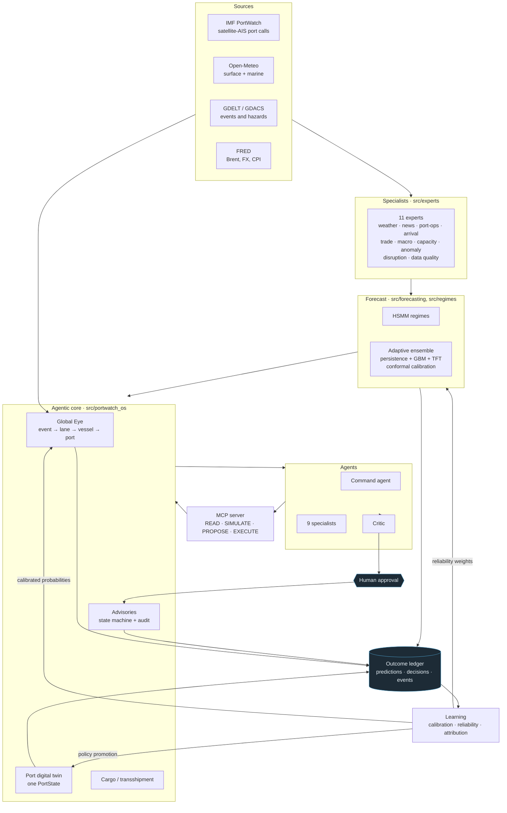

# India PortWatch

**An agentic maritime operations OS: predictive port digital twins, global event
intelligence, fleet and port optimisation, and a closed learning loop.**

India PortWatch observes maritime operations, predicts disruption, simulates the
consequences, recommends an operational response, tracks what actually happened,
and learns from the difference.

```
OBSERVE → UNDERSTAND → FORECAST → SIMULATE → DECIDE → ACT → LEARN
                                                              │
                    └─────────────────────────────────────────┘
```

The last arrow is the one most systems leave out. Every claim this product makes
is written to a ledger *before* the world answers it, scored against what
happened, and used to adjust what the system trusts next time. The screen that
shows you where it was wrong is a first-class feature, not an appendix.

---

## What it is, in four sentences

A duty officer at a national maritime centre sees every Indian port ranked by
where intervention matters, with world events traced through chokepoints and
trade lanes onto specific vessels and berths. A port authority runs a 3D digital
twin of its own terminal, optimises berth and yard assignment against it, and
issues arrival advisories that a carrier can accept, question or decline. A
shipping company sees which of its ships need intervention in the next 72 hours,
and by when the option closes. Everything either of them is told carries the
measurement it came from, and if the measurement does not exist the interface
says so instead of substituting a plausible number.

---

## Contents

- [Product modes](#product-modes)
- [Architecture](#architecture)
- [Agentic AI](#agentic-ai)
- [MCP](#mcp)
- [Global Eye](#global-eye)
- [The port digital twin](#the-port-digital-twin)
- [Cargo and transshipment](#cargo-and-transshipment)
- [Advisories: the human boundary](#advisories-the-human-boundary)
- [Learning](#learning)
- [RL safety](#rl-safety)
- [Data honesty](#data-honesty)
- [Models and accuracy](#models-and-accuracy)
- [Run it](#run-it)
- [Tests and CI](#tests-and-ci)
- [Limitations](#limitations)
- [Roadmap](#roadmap)
- [Documentation](#documentation)

---

## Product modes

Four roles, because the product answers four different questions. The pair that
most needs keeping apart is the port authority and the shipping company: they
are the two ends of an advisory, and collapsing them into one "operator" would
make the human approval step meaningless.

### National Command — `/admin`

*Where across the network does intervention matter?*

National maritime radar, Global Eye, every port ranked, carrier accounts, 3D
port twins, scenarios, the model bench, the learning dashboard, the agent
architecture, data provenance and system state.

### Port Authority — `/port`

*What is happening at my port, and what do I do about it?*

Local traffic and approaches, arrival management, forecast with calibrated
bands, weather, Global Eye scoped to this facility, the 3D digital twin with
berth/yard/crane optimisation, transshipment assignment, the decision queue, and
the advisories this port issues.

### Shipping Company — `/company`

*Which ships in my fleet require intervention over the next 72 hours?*

Fleet Command (map-first, with ACTION REQUIRED at the top of the rail), the
fleet roster scored against the event graph, lane exposure, Global Eye filtered
to this fleet, transshipment opportunities, risk windows with diversion
deadlines, and the advisories addressed to this carrier.

### Vessel / Bridge — `/vessel`

*Where should my ship go, and what am I exposed to?*

Own vessel, surrounding traffic, weather ahead, the passage and its alternative,
destination port risk, and the advisories addressed to this vessel — which are
recommendations, never instructions.

---

## Architecture



The loop closes at the bottom: the ledger feeds the learning layer, and the
learning layer feeds reliability back into the forecast, calibrated
probabilities back into Global Eye, and policy promotion back into the twin.

---

## Agentic AI

The division of labour is explicit and enforced at call time, not by convention.

| Layer | Responsibility | What it may not do |
|---|---|---|
| **Agents** | Choose which tools to call, in what order; reconcile what comes back; explain | Compute an operational number |
| **Tools** | Wrap a deterministic module and declare which one | Contain business logic of their own |
| **Models** | Predict, with calibrated uncertainty | Decide |
| **Optimisers** | Produce the numbers in a recommendation | Relax a physical constraint |
| **Critic** | Check a recommendation is supported, possible and safe | Raise confidence, or overrule a constraint |
| **Humans** | Approve, modify or reject | — |

**Agents orchestrate; tools compute.** Every `Finding` an agent produces names
the tool it came from, and every tool names the deterministic module that
produced its numbers — `computedBy` is a required field, and a test asserts that
no tool ships without one. The agent console shows that chain, so an operator
who does not believe an answer can open it and find the model.

### The agents

| Agent | Purpose | Ceiling |
|---|---|---|
| `command` | Route a question to the specialists that can answer it, in an order where each informs the next | PROPOSE |
| `global_eye` | Trace live events through chokepoints and lanes to ports and vessels | READ |
| `weather` | Marine conditions and forward operational impact | READ |
| `fleet` | Which vessels need intervention, and whether an action is still available | READ |
| `port_twin` | The port's operating state and how it evolves under a policy | SIMULATE |
| `route` | Score a vessel's routing against event, weather and port exposure | SIMULATE |
| `cargo` | Find and rank feasible transshipment connections | SIMULATE |
| `scenario` | Propagate a shock through the lane network | SIMULATE |
| `outcome` | Report how past claims scored and what changed as a result | READ |
| `advisory` | Draft an advisory for a controller to review | PROPOSE |
| `critic` | Judge a recommendation before a human sees it | — |

**No agent holds an EXECUTE ceiling.** That is asserted by a test, not just
documented.

### Where a language model fits, and where it does not

An LLM may be attached at two points: as the intent classifier that turns
"which ships are in trouble because of the Red Sea?" into `fleet_exposure`, and
as a narrator that renders findings into prose. It is given a PROPOSE ceiling and
never sees an approval context, so the worst a misclassification can do is run
the wrong read-only chain. A model answer that names an unknown intent is
ignored rather than trusted, and a classifier that throws falls back to keyword
matching.

**The product works with no model key at all.** The shipped classifier is
keyword matching; the LLM is an ergonomics upgrade, not a dependency.

### Confidence

Confidence propagates rather than being asserted. An agent's confidence is
bounded by the *minimum* of its inputs, not their mean — three confident reads
must not paper over one stale one — and each failed tool call and unfilled gap
discounts it further. No evidence at all yields `None`, which the UI renders as
unknown rather than as zero.

---

## MCP

The same tool registry the internal agents use, exposed over Model Context
Protocol. One registry, so a capability cannot exist over MCP that does not exist
internally, or carry a different access level there.

```bash
# List what is exposed and exit
python -m src.portwatch_os.mcp.server --list-tools

# Serve over stdio at the default PROPOSE ceiling
python -m src.portwatch_os.mcp.server

# EXECUTE requires a named human and their session
python -m src.portwatch_os.mcp.server --allow-execute \
  --approver "S. Iyer" --session-id "$PORTWATCH_SESSION"
```

### The boundary

| Level | Meaning | Tools |
|---|---|---|
| `READ` | Observe. No side effects | 15 |
| `SIMULATE` | Run a model or a what-if. No side effects | 6 |
| `PROPOSE` | Create a draft for a human to review | 1 |
| `EXECUTE` | Act. Requires an approval context | 2 |

At the default ceiling the EXECUTE tools are **not listed at all** — a client
never sees a capability it cannot use. Raising the ceiling still does not let a
model act: an EXECUTE call needs an `ApprovalContext` whose `human_verified` flag
is set only by `approval_from_session`, which requires a real authenticated
session id. A context an agent constructs itself is refused.

### The tools

```
portwatch.ports.list            portwatch.ports.get
portwatch.forecast.get          portwatch.weather.get
portwatch.global_eye.events     portwatch.global_eye.exposure
portwatch.company.fleet         portwatch.company.risk
portwatch.port_twin.state       portwatch.port_twin.simulate
portwatch.port_twin.benchmark   portwatch.routing.optimize
portwatch.cargo.opportunities   portwatch.cargo.optimize
portwatch.scenarios.simulate    portwatch.advisories.list
portwatch.advisories.draft      portwatch.advisories.issue
portwatch.advisories.respond    portwatch.learning.outcomes
portwatch.learning.reliability  portwatch.learning.policies
portwatch.provenance.get        portwatch.audit.advisory
```

Example — `portwatch.routing.optimize`:

```jsonc
// input
{ "vessel_id": "PWD-001", "destination": "INNSA", "risk_tolerance": "medium" }

// output (abridged)
{
  "lane": "Europe ↔ India (Suez)",
  "primaryRoutingNm": 4650,
  "alternativeRouting": "Cape of Good Hope",
  "detourNm": 3750,
  "detourHours": 214.3,
  "worstExposure": 0.654,
  "threshold": 0.40,
  "recommendation": "evaluate_diversion",
  "chokepointExposure": [ /* per event, with hoursToRiskArea and a deadline */ ],
  "provenance": {
    "routing": "Water-only routing graph; non-navigational.",
    "positions": "SIMULATED_TRAFFIC",
    "events": "GDELT/GDACS via the pipeline; see portwatch.provenance.get."
  },
  "note": "This is decision support, not a passage plan."
}
```

Two MCP resources describe the system to a client: `portwatch://agents` (the
architecture and the boundary) and `portwatch://provenance` (what is live,
cached, stale, simulated or unavailable right now).

---

## Global Eye

Not news on a map. Global Eye is a chain, and every hop is a measured
multiplication:

```
EVENT → CHOKEPOINT → TRADE LANE → VESSEL → PORT → IMPACT → ACTION
```

**Corroboration.** Fourteen headlines about one Red Sea incident become one
event with nine sources. Two items merge only when they share a category *and*
an anchor, fall inside a 36-hour window, *and* their headlines overlap above a
threshold — all four, because each alone produces obvious false merges.
Confidence is built from distinct *outlets*, not article count, and a second
independent feed counts for more than a second newspaper.

**Timing is the gate.** A vessel three days short of Bab-el-Mandeb can be
rerouted; one already north of it cannot. Global Eye computes both, reports them
separately, and never attaches a diversion recommendation to a vessel that has
already entered the risk area. The Critic rejects any recommendation that tries.

**Probabilities are earned.** The raw signal an event carries is severity ×
corroboration, where severity is a transparent word-list heuristic. That is not a
probability and is never shown as one. It becomes a percentage only once enough
resolved outcomes exist in that category to calibrate it; until then the screen
shows severity and confidence and says why the probability is withheld.

Lanes carry their real alternative and its cost, so an event becomes hours:

| Lane | Chokepoints | Primary | Alternative | Detour |
|---|---|---:|---|---:|
| Europe ↔ India | Suez, Bab-el-Mandeb | 4,650 nm | Cape of Good Hope | +3,750 nm |
| Persian Gulf ↔ India | Hormuz | 1,150 nm | **none exists** | — |
| South-east Asia ↔ India | Malacca | 1,900 nm | Sunda / Lombok | +550 nm |

A lane with no alternative is weighted *higher*, not lower: traffic cannot route
around the problem at all.

---

## The port digital twin

One `PortState` object is consumed by the 3D renderer, the discrete-event
simulator, the optimisers and the RL environment. That sharing is the whole
point — a 3D port that rendered its own idea of the terminal would be an
illustration; one that projects the object a policy is evaluated against is an
inspector.

**The geometry is schematic and says so on a banner that does not scroll away.**
Berth, yard, shed and crane *positions* are generated from published berth counts
and coastline orientation, not from a surveyed plan. What is real is what the
scene is coloured by: berth occupancy, yard utilisation, crane workload and queue
pressure all come from the state the simulator runs on. Counts, capacities and
operating rates are modelled from the port registry and the observed panel.

The twin carries berths (with length, draught and cargo type), quay cranes on a
shared rail that can be walked to a neighbouring berth, yard blocks with ground
slots and tiers, sheds, gates, internal vehicles and the arrival queue. Time
controls step it to +2h / +6h / +12h / +24h, each a real forward run rather than
an interpolation of the present.

### Port optimisation

Berth assignment, crane allocation, arrival staggering and yard placement are
optimised against that state. Measured on held-out simulated scenarios, against
the rule most terminals actually run:

| Policy | Family | Mean reward | vs first-come-first-served |
|---|---|---:|---:|
| Greedy shortest-work | optimiser | −197.3 | **+3.0%** |
| Greedy with arrival lookahead | optimiser | −196.8 | **+3.2%** |
| Contextual bandit rule selection | learned | −199.7 | +1.8% |
| First come, first served | rule (baseline) | −203.3 | — |
| Random feasible | baseline | −206.0 | −1.3% |

Reward is the operational cost function in
`src.portwatch_os.twin.simulation.REWARD_WEIGHTS`: it charges for waiting,
turnaround, missed departures, yard overflow and idle berths, and pays for
completed calls. Higher is better. No policy in the table produced a
hard-constraint violation or proposed an infeasible action.

**The simulator never relaxes a constraint.** A vessel too long or too deep for a
berth is not assigned to it, whatever a policy asks for; the action is refused
and recorded. That is how an unsafe learned policy fails its promotion gate
instead of quietly producing impossible schedules.

---

## Cargo and transshipment

*Can cargo arriving on Vessel A make Vessel B, which sails tonight?*

The demo manifest is schematic and labelled — no commercial cargo feed is
connected — but the feasibility logic is real, and it is what a live manifest
feed would drive unchanged: vessel slot capacity, reefer plugs, IMDG
certification, out-of-gauge handling, deadweight, the onward rotation, the yard
block's own capacity and segregation rules, and the connection window computed
from discharge, two yard moves, documentation overhead and load.

An unplaced shipment carries *every* reason it failed, not the first:

```
INMAA-SHP-055 → AEJEA   the shipment is ready at hour 41.9 but MV Konkan closes
                        loading at hour 15.0: short by 26.9 h
INMAA-SHP-019 → LKCMB   MV Coromandel has 131 reefer plugs free; 240 are needed
INMAA-SHP-005 → NLRTM   MV Konkan does not call at NLRTM on this rotation
```

The plan is a greedy assignment over value per TEU of scarce vessel capacity —
the binding constraints are integral, the instance is small, and a planner has to
be able to see why a box went where it did. It is **not presented as optimal**:
the value it left unplaced because capacity ran out is reported as the gap.

---

## Advisories: the human boundary

This is where the product stops recommending and starts communicating, and it is
enforced by a state machine rather than by convention.

```
        ┌─ withdraw ─────────────────────────────────┐
        │                                            ▼
DRAFT ──► UNDER_REVIEW ──► ISSUED ──► ACKNOWLEDGED ──► ACCEPTED ──► COMPLETED
   │           │              │             │
   │           ▼              ├─ QUERIED ───┤
   │        REJECTED          ├─ DECLINED   │
   │      (reason req.)       └─ EXPIRED ───┘  (clock only)
   └─ modify (original kept)
```

- A **draft is invisible to its recipient** until a named controller issues it.
  Without that, the approval step is theatre.
- Only the issuing port authority may issue, withdraw or close; only the
  recipient may accept, query or decline. A controller cannot accept on a
  vessel's behalf.
- **Declining is a normal terminal state** and costs nothing. PortWatch does not
  control vessel navigation, and the vocabulary is chosen so it cannot drift into
  pretending otherwise.
- Rejecting, declining and querying **require a recorded reason**. An audit trail
  without one cannot be reviewed later.
- When a controller edits a recommendation before issuing it, the original is
  kept. "The model said 18:30 and the controller made it 19:15" is exactly the
  signal the learning layer needs about whether the model is trusted.
- Expiry is the only system-driven transition, and it takes no caller identity.

The left-hand end is real too: `POST /api/advisories/generate` runs the twin
forward, finds the calls that actually waited, puts each recommendation through
the Critic, and drafts what survives. Calls under an hour of wait are skipped —
schedule buffer absorbs them, and a controller's attention is the scarce
resource. The Critic's refusals are returned as well, so a controller can see
what the engine considered and discarded.

---

## Learning

### Forecast learning

```
prediction (written before the answer) → observed outcome → calibration → reliability update
```

Every claim is written to the ledger with the context that was true at issue
time — port, horizon, regime, weather regime, season, source freshness — because
reliability is not a scalar property of a model but a property of a model *in a
context*. A weather expert well calibrated on the west coast pre-monsoon can be
badly biased on the south-east coast at +24 h during an active monsoon, and
blending those into one number hides both.

Three rules make the fit defensible:

- **Leakage.** A weight may only be fitted on rows observed before an explicit
  `as_of` barrier. A row past it *raises* rather than being skipped quietly,
  because a silent skip is how a leakage bug survives review.
- **Shrinkage.** Weights shrink toward 1.0 with a prior strength of 24
  observations, so nine bad rows in a context do not switch an expert off.
- **Bounded movement.** Weights are clamped to 0.35–1.60 and move at most 0.12
  per update. One bad monsoon week cannot silence a contributor, and recovery is
  equally gradual.

Measured on 4,000 walk-forward claims backfilled from the pipeline's own
evaluation:

| | |
|---|---:|
| Resolved claims | 4,000 |
| Mean absolute error | 6.33 |
| Bias | −0.82 |
| Interval coverage | 0.881 |
| Nominal coverage | 0.800 |
| Reliability weights fitted | 459 |

The intervals are *wider* than they need to be, which the dashboard says in
those words.

### "Why was PortWatch wrong?"

An exact decomposition, not a narrative. For a weighted blend

```
predicted = Σᵢ wᵢ · sᵢ    ⟹    y − predicted = Σᵢ wᵢ · (y − sᵢ)
```

so contributor *i* accounts for `wᵢ · (y − sᵢ)` of the miss. That identity is
what the screen renders, and a test asserts it closes. Two consequences worth
stating:

- If a prediction's per-contributor signals were not recorded, **no attribution
  is produced** — the UI says unavailable rather than drawing a plausible bar
  chart.
- Weights that do not sum to one leave a residual, reported as its own term
  rather than smeared across the contributors, because a blend that does not
  close is itself a finding.

### Event learning

```
event probability → horizon elapses → observed outcome → Brier / log loss → calibration
```

Global Eye commits a falsifiable claim with a horizon *before* the world answers.
A claim past its horizon with no confirming observation resolves as a measured
non-event, not a missing row — those are exactly the rows that would otherwise
drop every false alarm out of the calibration. Scored by Brier score and log
loss (proper rules: the way to win is to be honest about uncertainty), sliced by
category, region, source, horizon and confidence bucket, with lead time and
false-alarm rate tracked separately because the cost of a false alarm is not the
cost of a miss.

A false alarm is defined as a *confident* claim that did not happen. Below 0.5
the claim was hedged and the operator was told so.

### Operational learning

```
digital twin → policy → outcome → reward → offline evaluation → safe promotion
```

Recommendations are recorded in the decision ledger with what they claimed they
would achieve, and resolved with what happened and whether the operator took
them. **Take-up rate is reported alongside reward**: a recommendation nobody
accepts has no operational value however good its simulated reward looks.

---

## RL safety

RL is used for operational *policy* optimisation — which berth, which crane
gang, whether to stagger an arrival. It is not used to predict whether it will
rain.

**Everything trains and is evaluated in simulation.** Training seeds start at
1,000,000 and evaluation seeds at 9,000,000; the ranges cannot overlap for any
episode count this repository will run, and a test asserts they are disjoint.

A candidate policy must clear every one of these before a human may even be asked
to approve it:

| Check | What it means |
|---|---|
| `beats_baseline` | Higher mean reward than the incumbent rule, by at least 1% |
| `beats_best_optimiser` | **Higher mean reward than the best hand-written optimiser** |
| `no_violations` | Zero hard-constraint breaches across the evaluation |
| `no_rejected_actions` | Never proposed an infeasible action |
| `tail_not_worse` | Worst episode not materially worse than the baseline's worst |
| `sufficient_episodes` | At least 30 held-out episodes |
| `held_out_seeds` | Evaluation seeds disjoint from training seeds — checked, not assumed |

Then a **named human** approves it. The ledger refuses an APPROVED transition
with no approver or a failing safety check, so this is enforced by storage rather
than by procedure.

### The current verdict, reported as measured

The contextual bandit **is rejected**. It beats first-come-first-served by 5.6%
but the best hand-written optimiser by only 0.8%, under the 1% threshold:

> *bandit is not promotable: mean reward −184.8 against the best optimiser
> (Greedy with arrival lookahead) at −186.4, a margin of +1.6 (+0.8%). The
> learned policy does not beat a simpler optimiser, so promoting it would add
> complexity for no measured gain.*

No policy is approved, so the recommendation path uses the hand-written
optimiser. **That is the gate working, not the gate failing**, and the rejected
policy is kept with its reasons because the record of why a learned policy was
not shipped is the evidence that the gate does anything.

### Why a bandit and not PPO

The berth-assignment inner loop is already solved well by the optimisers; what
was *not* known is which of them suits a congested yard in bad weather versus a
quiet morning — a rule-selection problem. Episodes are short and the reward is
terminal, so there is no long credit-assignment chain for a value function to
earn its keep on. And UCB1's choice is auditable: "this arm has the best mean
reward in this context, over this many trials" is something a port controller can
question. A policy network's logits are not, and this product will not deploy a
recommendation nobody can interrogate. If the action space later becomes
per-vessel sequencing over a long horizon, that argument changes.

---

## Data honesty

Every source declares its own state, and the state is enforced rather than
asserted: a feed claiming `LIVE` whose newest observation is past its freshness
budget is automatically downgraded to `STALE`.

| State | Meaning |
|---|---|
| `LIVE` | Fetched from the provider during this run, observation inside the budget |
| `CACHED_LIVE` | Real provider data replayed from the local cache, still fresh |
| `STALE` | Real provider data past its budget — usable at reduced confidence, labelled everywhere |
| `SYNTHETIC` | Modelled or generated stand-in. Never presented as measured |
| `SCHEMATIC` | Geometry generated from published counts, not surveyed |
| `UNAVAILABLE` | The source failed and no usable fallback exists |

| Source | Provider | Typical state | What it feeds |
|---|---|---|---|
| Port activity | IMF PortWatch (ArcGIS, keyless) | `CACHED_LIVE` → `STALE` | Congestion index, throughput, utilisation, berth-wait proxy |
| Marine weather | Open-Meteo forecast + marine (keyless) | `LIVE` | Wind, gusts, precipitation, visibility, 10-day known-future covariate |
| Weather history | Open-Meteo ERA5 archive | `CACHED_LIVE` | Weather-aware training over the full port history |
| Maritime events | GDELT DOC 2.0 + GDACS | `CACHED_LIVE` | Global Eye events, exposure, chokepoint risk |
| Chokepoint transits | IMF PortWatch daily chokepoints | `CACHED_LIVE` | Disruption propagation onto exposed ports |
| Macro conditions | FRED (Brent, USD/INR, CPI) | `LIVE` | Oil, FX and inflation stress in the regime model |
| **Per-vessel AIS** | — | `SIMULATED_TRAFFIC` | The traffic layer is a deterministic replay engine, not observed AIS |
| **Port geometry** | — | `SCHEMATIC` | Berth/yard/shed positions generated from berth counts |
| **Cargo manifests** | — | `SYNTHETIC` | Demo shipments generated from observed throughput |
| **Carrier fleet** | — | `SIMULATED_TRAFFIC` | A fictional demo carrier; the interface is the seam a real account plugs into |
| Sentinel-1 SAR detection | — | `UNAVAILABLE` | Not wired. Reported as unavailable rather than drawn |
| Significant wave height | — | `UNAVAILABLE` | The marine feed returned none. Not substituted |

### Stated plainly

- **There is no licensed live vessel AIS in this deployment.** Every vessel on
  the map comes from a deterministic replay engine, the status strip says
  `SIMULATED REPLAY`, and swapping in a real provider is one implementation of
  the `TrafficSource` interface and nothing else.
- **No real carrier's voyages appear anywhere.** The fleet belongs to *PortWatch
  Demo Shipping*, a fictional operator whose vessels are named after Indian Ocean
  geography specifically so a screenshot cannot be mistaken for a real fleet. No
  IMO numbers are issued to fictional hulls.
- **3D port layouts are schematic where real geometry is absent**, with a banner
  that does not scroll away.
- **Cargo flows are demo data** where no commercial feed exists, labelled on
  every screen that shows them.
- **Maritime routing is non-navigational.** The routing graph is A* over a water
  raster derived from Natural Earth land polygons. It guarantees a line does not
  cross land; it is not a passage plan and must not be used for navigation.
- **Predictions are decision support, not navigation instructions.**

`GET /api/provenance` returns the full registry; `GET /api/health` returns the
summary the terminal renders on every screen.

---

## Models and accuracy

### Protocol

Expanding-window walk-forward over the same supervised frame for every
candidate. A training row is used only if its label was already observable at
the fold cutoff. The ensemble weighting policy is fitted **exclusively on
out-of-fold predictions**, and the ensemble is scored on the same rows as every
baseline.

Reproduce with:

```bash
python -m src.evaluation.model_benchmark --folds 4
```

### Results

4 expanding folds · 28,740 out-of-fold predictions · target `congestion_index`
(0–100) · horizon 10 days.

| Model | MAE | RMSE | MAPE % | Pinball q50 | 80% coverage | Calib. error |
|---|---:|---:|---:|---:|---:|---:|
| **Adaptive ensemble** | **7.43** | **10.14** | **14.65** | **3.71** | **0.807** | **0.007** |
| GBM quantile | 8.06 | 10.86 | 15.38 | 4.03 | 0.707 | 0.093 |
| Naive persistence | 8.08 | 11.10 | 15.94 | 4.04 | 0.784 | 0.016 |
| Seasonal naive (7d) | 10.58 | 14.08 | 20.78 | — | — | — |
| TFT (deep)¹ | 10.71 | 12.32 | 29.47 | 5.36 | 0.037 | 0.763 |
| Ridge quantile | 11.10 | 14.09 | 22.52 | 5.55 | 0.575 | 0.225 |

¹ Scored on the 7,320 rows where the deep model had enough history to train.
The ensemble's headline skill is computed **paired**, on rows both models cover.

**Skill against naive persistence: +8.1% MAE.** The ensemble is also the only
model whose intervals are calibrated: 0.53 / 0.81 / 0.90 empirical against
0.50 / 0.80 / 0.90 nominal.

Exact figures move by a few hundredths between runs: the deep member's training
is stochastic, and it is retrained per fold. The ordering, the calibration and
the horizon structure below are stable. `outputs/forecasts/benchmark_summary.json`
records the run these numbers came from.

### Accuracy by horizon (MAE)

| Horizon | Ensemble | Persistence | GBM | TFT |
|---:|---:|---:|---:|---:|
| +1d | **3.73** | 3.75 | 4.55 | 10.87 |
| +3d | **6.04** | 6.39 | 6.60 | 11.09 |
| +5d | **7.77** | 8.40 | 8.52 | 10.96 |
| +7d | **9.02** | 10.02 | 9.63 | 9.70 |
| +9d | **9.20** | 10.24 | 9.76 | 8.71 |
| +10d | **9.30** | 10.36 | 9.86 | — |

This is the finding that shaped the model. **Nothing beats persistence at one
day** on a seven-day-smoothed congestion index, and the first honest run of this
benchmark showed persistence beating every learned model at *every* horizon.
Two changes fixed that, and the benchmark is what proves it:

1. **Residual formulation.** The GBM and ridge now predict the *departure* from
   the last observed value, `y(t+h) = y(t) + f(x, h)`, so persistence is the
   model's prior and the learned part only has to capture what changes.
2. **A stack over horizon.** Probabilistic persistence became a first-class
   ensemble member, and the blend weights are fitted per horizon:

   | Horizon | persistence | GBM | TFT |
   |---:|---:|---:|---:|
   | +1d | 0.80 | 0.10 | 0.10 |
   | +3d | 0.50 | 0.40 | 0.10 |
   | +6d | 0.40 | 0.40 | 0.20 |
   | +10d | 0.20 | 0.30 | 0.50 |

   The learned weights recover the physics: persistence dominates tomorrow, the
   models take over from mid-horizon. Nobody wrote that schedule down.

### Accuracy by HSMM regime (MAE)

| Regime | Ensemble | Persistence | GBM | TFT |
|---|---:|---:|---:|---:|
| NORMAL | **6.96** | 7.70 | 7.04 | 11.21 |
| CONGESTED | 7.40 | 8.28 | **7.35** | 11.46 |
| SEVERE | 7.64 | 8.01 | 9.29 | **7.48** |

Reported as measured, including the cells the ensemble loses: the GBM alone
edges it in CONGESTED, and the deep model is the single best entry in SEVERE —
which is a real finding about where a sequence model earns its keep, not a
number to bury.

### What the deep model actually contributes

The TFT is a real `pytorch-forecasting` Temporal Fusion Transformer, trained
per fold on pre-cutoff data only. It is **worse overall** (MAE 10.71, last in
the table) and its intervals are badly miscalibrated — 3.7% coverage against a
nominal 80%, which makes them unusable on their own.

But look at what it does with lead time. It is the *only* model whose error
**falls** as the horizon grows: 10.87 at +1d down to 8.71 at +9d, where it beats
every other entry. It is also the best model in the SEVERE regime. So the
stacker gives it 0.10 weight at day 1 and 0.50 at day 10 — it learned to use the
deep model exactly where the deep model is good, and to ignore it elsewhere.
That is the ensemble earning its name, and it is the argument for keeping a
model that loses on the headline number.

Install it with `pip install -r requirements-tft.txt`. Without it the ensemble
runs on persistence + GBM and the benchmark reports the TFT as not evaluated,
rather than quoting a number it did not measure.

### Artefacts

| File | Contents |
|---|---|
| `outputs/forecasts/model_benchmark.csv` | One row per model |
| `outputs/forecasts/horizon_benchmark.csv` | Accuracy by lead time |
| `outputs/forecasts/port_benchmark.csv` | Accuracy by port |
| `outputs/forecasts/regime_benchmark.csv` | Accuracy by HSMM regime |
| `outputs/forecasts/calibration.json` | Nominal vs empirical coverage curve |
| `outputs/forecasts/ensemble_weights.json` | The fitted stacking policy |
| `outputs/forecasts/benchmark_summary.json` | Headline numbers and the protocol |

---


## Run it

### Prerequisites

Python 3.11+ and Node 22+.

```bash
pip install -r requirements.txt
cd india-portwatch-terminal && npm ci && cd ..
```

### One command

```bash
python run_award_demo.py --source portwatch --model ensemble
```

That runs the whole chain — live acquisition, eleven experts, HSMM regimes, the
calibrated ensemble forecast, decisions, routing, the API cache and provenance
export, and then the learning pass: it backfills the ledger from the run's own
walk-forward history, scores it, fits reliability weights, commits a falsifiable
claim per live event, trains a candidate policy in the twin and puts it through
the promotion gate. **About two minutes** on live data.

Useful flags:

| Flag | Effect | Cost |
|---|---|---|
| `--refresh` | Pull a fresh IMF PortWatch snapshot before running | +30s |
| `--benchmark` | Run the walk-forward benchmark and refit the ensemble policy | +1 min |
| `--deep` | Include the TFT as an ensemble member | +20 min |
| `--offline` | Skip every network call and run on cached data only | faster |
| `--source sample` | Run on the bundled synthetic bundle (no network at all) | ~40s |
| `--model baseline` | GBM only, skipping the ensemble | faster |

### Serve it

```bash
uvicorn backend.app.main:app --reload --port 8000
```

```bash
cd india-portwatch-terminal && npm run dev
```

Point the terminal at the API with `india-portwatch-terminal/.env`:

```
VITE_PORTWATCH_API_BASE=http://localhost:8000/api
```

Then open the terminal (Vite prints the port) and check
<http://localhost:8000/api/health> for the twin's operational state.

Demo sign-in — the credentials are published in the client bundle and verify
nothing, which the sign-in screen says:

| Account | Role | Lands on |
|---|---|---|
| `admin@portwatch.demo` | National Command | `/admin/radar` |
| `port@portwatch.demo` | Port Authority (Chennai) | `/port/overview` |
| `company@portwatch.demo` | Shipping Company | `/company/overview` |
| `vessel@portwatch.demo` | Vessel Operator | `/vessel/overview` |

Password for all four: `portwatch`.

### MCP server

```bash
python -m src.portwatch_os.mcp.server --list-tools     # inspect and exit
python -m src.portwatch_os.mcp.server                  # serve over stdio
```

### Docker

```bash
cp .env.example .env
docker compose up --build
```

### Keep it current

```bash
python scripts/live_refresh.py --interval-minutes 30 --source portwatch
```

---

## Tests and CI

```bash
python -m unittest discover -s tests -p "test_*.py"    # 305 tests
cd india-portwatch-terminal
npm run typecheck && npm run build
npm run test:browser                                   # 132 specs across three viewports
```

| Suite | Covers |
|---|---|
| `test_api_contract.py` | Every API route's shape, and its 503 when an artefact is missing |
| `test_award_intelligence.py` | Experts, regimes, ensemble, provenance, decision layer |
| `test_forecast_evaluation.py` | Walk-forward protocol, calibration, leakage |
| `test_decision_and_scenarios.py` | Decision cascade, scenario propagation, routing |
| `test_weather_expert.py` | Weather features and the known-future covariate |
| `test_global_eye.py` | Ingestion, dedupe, corroboration, exposure, the timing gate, calibration |
| `test_agents_and_mcp.py` | Tool access levels, agent boundaries, Critic verdicts, MCP protocol |
| `test_learning_ledger.py` | Ledger integrity, scoring rules, reliability leakage, attribution identity, policy promotion |
| `test_twin_and_cargo.py` | Twin determinism, constraint enforcement, policy benchmark, cargo feasibility |
| `test_advisories.py` | State machine, authorisation, visibility, audit trail |

The browser suite drives the **production build**, not the dev server, and
replays a recorded API so it needs no backend and no network. It runs every
screen at 1920×1080, 1440×900 and 1366×768 and fails a screen that renders while
throwing a console error, dropping a request, or pushing the page sideways.

CI runs the two outer viewports (`npm run test:browser:ci`). For layout risk
1366×768 strictly dominates 1440×900 — narrower *and* shorter — so the middle
viewport earns its place in the local QA pass rather than in CI, where it would
add a third of the runtime and no coverage.

It also asserts the claims this product makes about itself, because those are the
easiest thing to break silently: that the weather composite is on by default and
names what it carries, that the forecast cursor plays and *stops*, that a
schematic twin still carries its banner, that an uncalibrated event says so
rather than showing a number, that no vessel already in a risk area appears in
the action queue, and that no agent in the catalogue holds an EXECUTE ceiling.

CI runs four jobs. The operations suites go first and alone: 218 tests that need
no artefacts, no network and no pipeline run, so a broken safety boundary is
reported in seconds rather than after a full pipeline. Then the intelligence job
runs the pipeline offline end to end — the whole provenance design exists so that
a degraded run is honest rather than broken — benchmarks it, verifies the
artefacts and runs everything again against a real artefact tree. Terminal
typecheck and build, and the browser regression, run alongside. Deep RL training
and the TFT stay out: the twin suites train 20–40 episodes on fixed seeds.

---

## Limitations

Written plainly, because a system that reports its own uncertainty has to report
its own boundaries too.

- **No licensed AIS.** Vessel traffic is a deterministic replay engine. Nothing
  on the map is an observed position.
- **No surveyed port geometry.** The 3D twins are schematic. Counts, capacities
  and rates are modelled; positions are generated.
- **No commercial cargo feed.** Transshipment shipments are demo data. The
  feasibility rules are real and would drive a live feed unchanged.
- **The demo carrier is fictional.** The account interface is the seam a real
  carrier plugs into; nothing in the shipped fleet is a real voyage.
- **Advisory identity is asserted, not verified.** The API says so in its own
  `/advisories/policy` response, and names the function to replace.
- **Event severity is a heuristic**, and stays one until enough outcomes resolve
  to calibrate it. Event calibration is currently **unavailable**: 26 claims are
  committed with their horizons and none has elapsed.
- **The bandit is not promoted.** It does not beat the hand-written optimiser by
  enough to justify the complexity, and the gate says so.
- **Wind direction is monsoon climatology**, not an observation. The feed carries
  none, and every surface showing it says MODELLED.
- **Significant wave height is unavailable.** Not substituted with a modelled sea
  state.
- **The routing graph is non-navigational.** It guarantees water, not a passage
  plan.
- **Storm motion is inferred** from the risk gradient between stations. There is
  no forecast track, because the artefact carries none and a cone of uncertainty
  would be an invention.

---

## Roadmap

**Now**

- Maritime digital twin with a shared logical port state
- Global Eye: event → chokepoint → lane → vessel → port → action
- Fleet command for a carrier account
- Agent orchestration with a Critic and an enforced approval boundary
- MCP tool layer with READ / SIMULATE / PROPOSE / EXECUTE
- Outcome ledger, calibration, contextual reliability and error attribution
- Digital-twin policy learning with a safe promotion gate
- Human-approved port-to-vessel advisories with a full audit trail

**Future multimodal expansion**

The architecture already separates the physical layer (the twin's state) from the
optimisation layer, so the following are provider implementations rather than
rewrites. **None of them is a current feature.**

- Licensed live AIS, replacing the replay engine behind `TrafficSource`
- Surveyed port geometry, replacing the schematic layout generator
- Commercial cargo and manifest feeds behind the existing feasibility rules
- Rail freight and inland container depots
- Road freight and drayage
- Airport cargo
- Real port-authority and carrier account integrations

## Documentation

Each page goes deeper than this README and states its own boundaries.

| Page | Covers |
|---|---|
| [docs/ARCHITECTURE.md](docs/ARCHITECTURE.md) | The layers, where each one's authority ends, the pipeline, storage, and the seams to extend |
| [docs/AGENTIC_AI.md](docs/AGENTIC_AI.md) | The access boundary, the agents, the Critic's checks, confidence propagation, where a language model fits |
| [docs/MCP.md](docs/MCP.md) | Running the server, the 24 tools with their access levels, the refusal shape, the resources |
| [docs/GLOBAL_EYE.md](docs/GLOBAL_EYE.md) | Corroboration and dedupe, the lane catalogue, the timing gate, why the probability is unavailable |
| [docs/PORT_TWIN.md](docs/PORT_TWIN.md) | What is real and what is schematic, the work-rate model, the reward function, the measured policy results |
| [docs/LEARNING.md](docs/LEARNING.md) | The ledger's enforced properties, proper scoring, contextual reliability, the exact attribution identity |
| [docs/API_CONTRACT.md](docs/API_CONTRACT.md) | Every route, the identity headers, and what each status code means |
| [docs/DATA_AUDIT.md](docs/DATA_AUDIT.md) | Field by field: measured, derived, proxy, simulated, schematic or absent |
| [docs/REPO_AUDIT.md](docs/REPO_AUDIT.md) | The repository map — which module produces any number on screen |
| [docs/DATA_SOURCES.md](docs/DATA_SOURCES.md) | Every external feed, its licence and its freshness budget |
| [docs/AWARD_DEMO.md](docs/AWARD_DEMO.md) | The two-minute demo script, the questions you will be asked, and what to do if something breaks |

---

---

## Licence

MIT. See [LICENSE](LICENSE).
