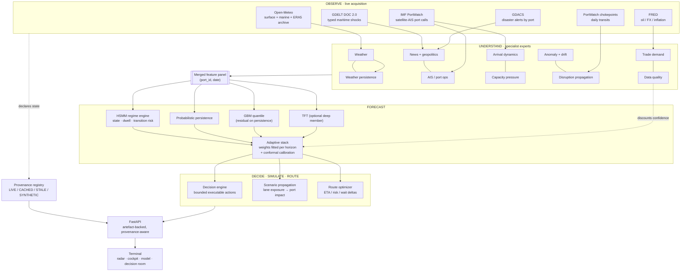

# India PortWatch

**Predictive maritime digital twin and autonomous operations intelligence for Indian ports.**

India PortWatch answers one question for a port operations desk, a shipping
line or a maritime agency:

> **Which port needs intervention right now, why, and what should we do about it?**

It observes real satellite-AIS port activity, live marine weather and global
maritime events; understands them through a bank of specialist experts;
forecasts congestion ten days ahead with calibrated uncertainty; simulates
shocks against that forecast; and turns the result into a specific, bounded,
measurable operational instruction.

```
OBSERVE  →  UNDERSTAND  →  FORECAST  →  SIMULATE  →  DECIDE  →  ROUTE
```

Every number the terminal displays is traceable to an artefact the pipeline
wrote. Where a measurement does not exist, the interface says `n/a`; where a
feed is stale, it says `STALE` and shows the age. That is a deliberate design
constraint, not a limitation — a control-room tool that quietly substitutes a
plausible number is worse than one that goes dark.

---

## Contents

- [What it does](#what-it-does)
- [Architecture](#architecture)
- [Data sources and provenance](#data-sources-and-provenance)
- [Models and accuracy](#models-and-accuracy)
- [Screens](#screens)
- [Run it](#run-it)
- [Deploy it](#deploy-it)
- [Tests and CI](#tests-and-ci)
- [Honest limitations](#honest-limitations)

---

## What it does

| Stage | What happens | Where it lives |
|---|---|---|
| **Observe** | Daily satellite-AIS port calls and trade tonnage per Indian port (IMF PortWatch); live surface + marine weather and a 10-day forecast per port (Open-Meteo); typed maritime shocks from GDELT and disaster alerts from GDACS; chokepoint transit counts for six global waterways | `src/ingestion/` |
| **Understand** | Ten specialist experts turn raw signals into bounded, leakage-safe features: weather, weather persistence, news/geopolitics, AIS port-ops, arrival dynamics, trade demand, macro, capacity pressure, anomaly detection, disruption propagation, and data quality | `src/experts/` |
| **Forecast** | An HSMM infers the operating regime and its expected dwell; a stacked ensemble of probabilistic persistence, a GBM quantile model and (optionally) a Temporal Fusion Transformer produces a 10-day q10/q50/q90 forecast with per-horizon conformal calibration | `src/regimes/`, `src/forecasting/` |
| **Simulate** | Ten typed shocks propagate through a measured lane-exposure graph onto specific ports, and the deltas are the difference between two forecasts the system actually produced | `src/decision/scenario_service.py` |
| **Decide** | A deterministic rule cascade issues a bounded, executable action with its target, horizon, ranked driver contributions, expected delay saved, fallback and uncertainty | `src/decision/decision_layer.py` |
| **Route** | The fleet optimizer scores each vessel's intended call against the best alternative and reports the ETA, risk and port-wait difference between them | `src/decision/route_optimizer.py` |

---

## Architecture



**One source of truth for ports.** `src/utils/port_registry.py` ties together
each port's model id, UN/LOCODE, IMF PortWatch feed id, geography and static
capacity attributes. The pipeline, the API and the terminal all resolve through
it, and legacy codes alias forward.

---

## Data sources and provenance

Every source declares its own state, and the state is enforced rather than
asserted: a feed that claims `LIVE` but whose newest observation is older than
its freshness budget is automatically downgraded to `STALE`.

| State | Meaning |
|---|---|
| `LIVE` | Fetched from the provider during this run, observation inside the budget |
| `CACHED_LIVE` | Real provider data replayed from the local cache, still fresh |
| `STALE` | Real provider data, past its freshness budget — usable at reduced confidence, labelled everywhere |
| `SYNTHETIC` | Modelled or generated stand-in. Never presented as measured |
| `UNAVAILABLE` | The source failed and no usable fallback exists |

| Source | Provider | Typical state | What it feeds |
|---|---|---|---|
| Port activity | IMF PortWatch (ArcGIS, keyless) | `CACHED_LIVE` → `STALE` | Congestion index, throughput, utilization, berth-wait proxy |
| Marine weather | Open-Meteo forecast + marine (keyless) | `LIVE` | Wind, gusts, precipitation, visibility, wave height, 10-day known-future covariate |
| Weather history | Open-Meteo ERA5 archive | `CACHED_LIVE` | Weather-aware training over the full port history |
| Maritime events | GDELT DOC 2.0 + GDACS | `CACHED_LIVE` | Port-attributed event risk, terminal event stream with source links |
| Chokepoint transits | IMF PortWatch daily chokepoints | `CACHED_LIVE` | Disruption propagation onto exposed ports |
| Macro conditions | FRED (Brent, USD/INR, CPI) | `LIVE` | Oil, FX and inflation stress in the regime model |
| Per-vessel AIS tracks | — | `UNAVAILABLE` | Not licensed here. The map shows daily port-call **aggregates** and says so |
| Sentinel-1 SAR detection | — | `UNAVAILABLE` | Not wired here. Reported as unavailable rather than drawn |

`GET /api/provenance` returns the full registry; `GET /api/health` returns the
summary the terminal renders on every screen.

---

## Models and accuracy

### Protocol

Expanding-window walk-forward over the same supervised frame for every
candidate. A training row is used only if its label was already observable at
the fold cutoff. The ensemble weighting policy is fitted **exclusively on
out-of-fold predictions**, and the ensemble is scored on the same rows as every
baseline.

Reproduce with:

```bash
python -m src.evaluation.model_benchmark --folds 4
```

### Results

4 expanding folds · 28,740 out-of-fold predictions · target `congestion_index`
(0–100) · horizon 10 days.

| Model | MAE | RMSE | MAPE % | Pinball q50 | 80% coverage | Calib. error |
|---|---:|---:|---:|---:|---:|---:|
| **Adaptive ensemble** | **7.47** | **10.19** | **14.75** | **3.73** | **0.806** | **0.006** |
| Naive persistence | 8.08 | 11.10 | 15.94 | 4.04 | 0.784 | 0.016 |
| GBM quantile | 8.14 | 10.88 | 15.65 | 4.07 | 0.664 | 0.136 |
| TFT (deep)¹ | 8.72 | 11.08 | 24.69 | 4.36 | 0.045 | 0.755 |
| Seasonal naive (7d) | 10.58 | 14.08 | 20.78 | — | — | — |
| Ridge quantile | 11.18 | 14.11 | 22.34 | 5.59 | 0.568 | 0.232 |

¹ Scored on the 7,320 rows where the deep model had enough history to train.
The ensemble's headline skill is computed **paired**, on rows both models cover.

**Skill against naive persistence: +7.6% MAE.** The ensemble is also the only
model whose intervals are calibrated: 0.53 / 0.81 / 0.90 empirical against
0.50 / 0.80 / 0.90 nominal.

### Accuracy by horizon (MAE)

| Horizon | Ensemble | Persistence | GBM | TFT |
|---:|---:|---:|---:|---:|
| +1d | **3.74** | 3.75 | 4.53 | 9.09 |
| +3d | **6.06** | 6.39 | 6.60 | 8.98 |
| +5d | **7.81** | 8.40 | 8.65 | 8.34 |
| +7d | **9.07** | 10.02 | 9.75 | 8.31 |
| +10d | **9.41** | 10.36 | 9.99 | — |

This is the finding that shaped the model. **Nothing beats persistence at one
day** on a seven-day-smoothed congestion index, and the first honest run of this
benchmark showed persistence beating every learned model at *every* horizon.
Two changes fixed that, and the benchmark is what proves it:

1. **Residual formulation.** The GBM and ridge now predict the *departure* from
   the last observed value, `y(t+h) = y(t) + f(x, h)`, so persistence is the
   model's prior and the learned part only has to capture what changes.
2. **A stack over horizon.** Probabilistic persistence became a first-class
   ensemble member, and the blend weights are fitted per horizon:

   | Horizon | persistence | GBM | TFT |
   |---:|---:|---:|---:|
   | +1d | 0.80 | 0.10 | 0.10 |
   | +3d | 0.50 | 0.40 | 0.10 |
   | +6d | 0.30 | 0.30 | 0.40 |
   | +10d | 0.40 | 0.50 | 0.10 |

   The learned weights recover the physics: persistence dominates tomorrow, the
   models take over from mid-horizon. Nobody wrote that schedule down.

### Accuracy by HSMM regime (MAE)

| Regime | Ensemble | Persistence | GBM |
|---|---:|---:|---:|
| NORMAL | **7.45** | 8.21 | 7.51 |
| CONGESTED | 4.76 | **4.60** | 8.15 |
| SEVERE | **8.13** | 8.42 | 10.36 |

Reported as measured: in the CONGESTED regime persistence still edges the
ensemble. That cell has the fewest out-of-fold rows, and the honest reading is
that the advantage is not yet established there.

### What the deep model actually contributes

The TFT is a real `pytorch-forecasting` Temporal Fusion Transformer, trained
per fold on pre-cutoff data only. It is **worse overall** (MAE 8.72) and its
intervals are badly miscalibrated (4.5% coverage against a nominal 80%). But it
is the best model at long lead times — 7.00 MAE at +9d against the GBM's 9.89 —
which is exactly why the stacker gives it 0.3–0.4 weight at horizons 4–9 and
almost none at day 1. That is the ensemble earning its name.

Install it with `pip install -r requirements-tft.txt`. Without it the ensemble
runs on persistence + GBM and the benchmark reports the TFT as not evaluated,
rather than quoting a number it did not measure.

### Artefacts

| File | Contents |
|---|---|
| `outputs/forecasts/model_benchmark.csv` | One row per model |
| `outputs/forecasts/horizon_benchmark.csv` | Accuracy by lead time |
| `outputs/forecasts/port_benchmark.csv` | Accuracy by port |
| `outputs/forecasts/regime_benchmark.csv` | Accuracy by HSMM regime |
| `outputs/forecasts/calibration.json` | Nominal vs empirical coverage curve |
| `outputs/forecasts/ensemble_weights.json` | The fitted stacking policy |
| `outputs/forecasts/benchmark_summary.json` | Headline numbers and the protocol |

---

## Screens

| Screen | Question it answers |
|---|---|
| **National Radar** | Which port needs intervention right now, and why? |
| **Port Cockpit** | NOW / REGIME / NEXT 24H / NEXT 10 DAYS / WHY / WHAT TO DO for one port |
| **Model Intelligence** | How do we know? Benchmark, drilldowns, calibration, ensemble weights, full provenance |
| **Decision Room** | What happens if Hormuz closes — and what do we do about it? |
| **Fleet Board** | Keep the call or divert, with the ETA / risk / wait trade-off |
| **Weather Intelligence** | Measured conditions, the risk decomposition the model used, shock vs sustained |
| **Vessel Activity** | Measured daily port-call aggregates — and an explicit statement of what is *not* tracked |
| **Event Intelligence** | Every headline, its source link, and the lane exposure that attributed it to a port |

---

## Run it

### Prerequisites

Python 3.11+ and Node 22+.

```bash
pip install -r requirements.txt
cd india-portwatch-terminal && npm ci && cd ..
```

### One command

```bash
python run_award_demo.py --source portwatch --model ensemble --benchmark
```

That single command runs the whole chain — live acquisition, ten experts, HSMM
regimes, the walk-forward benchmark, the calibrated ensemble forecast,
decisions, routing, and the API cache and provenance export.

Useful flags:

| Flag | Effect |
|---|---|
| `--refresh` | Pull a fresh IMF PortWatch snapshot before running |
| `--benchmark` | Run the walk-forward benchmark and refit the ensemble policy |
| `--offline` | Skip every network call and run on cached data only |
| `--source sample` | Run on the bundled synthetic bundle (no network at all) |
| `--model baseline` | GBM only, skipping the ensemble |

### Serve it

```bash
uvicorn backend.app.main:app --reload --port 8000
```

```bash
cd india-portwatch-terminal && npm run dev
```

Point the terminal at the API by creating `india-portwatch-terminal/.env`:

```
VITE_PORTWATCH_API_BASE=http://localhost:8000/api
```

Then open the terminal (Vite prints the port) and check
<http://localhost:8000/api/health> for the twin's operational state.

### Keep it current

```bash
python scripts/live_refresh.py --interval-minutes 30 --source portwatch
```

---

## Deploy it

### Docker Compose — the whole system

```bash
cp .env.example .env
docker compose up --build
```

This runs the pipeline once, serves the API on `:8000` and the terminal on
`:3000`. Add the refresher to keep the twin live:

```bash
docker compose --profile live up -d refresher
```

### Production notes

- Set `PORTWATCH_CORS_REGEX` to the exact deployed terminal origin.
- `VITE_PORTWATCH_API_BASE` is inlined by Vite at build time, so pass it as a
  build argument (`--build-arg`), not a runtime variable.
- The API is stateless over the artefact volume: scale it horizontally and let
  one refresher own the writes.
- `GET /api/health` is the container health check; it reports `degraded` until
  the first pipeline run completes.
- The optional PostgreSQL + Kafka profile backs the research pipeline's
  production path; without it the system falls back to SQLite and an in-memory
  bus.

---

## Tests and CI

```bash
python -m unittest discover -s tests -p "test_*.py" -v   # 87 tests
python scripts/verify_artefacts.py                        # artefact coherence gate
python scripts/ui_smoke.py --base-url http://localhost:5173
cd india-portwatch-terminal && npx tsc --noEmit && npm run build
```

The suite covers anomaly spike detection and its leakage safety, capacity and
queue momentum, arrival clustering, disruption propagation ordering, weather
shock vs persistence, data-quality degradation, quantile monotonicity, conformal
coverage, walk-forward fold construction, stacking weights, decision bounds
(a slow-steam order must be executable; a passive action may not claim a
saving), scenario propagation and exposure ordering, provenance state
transitions, the port registry, and the full API contract in both its ready and
degraded forms.

`scripts/ui_smoke.py` drives all eight screens at 1920×1080, 1440×900 and
1366×768, failing on console errors, failed requests or horizontal overflow, and
captures a screenshot of each.

CI (`.github/workflows/award-ci.yml`) compiles every module, runs the pipeline
end to end **with no network**, runs the benchmark, verifies the artefacts, runs
the test suite, and typechecks and builds the terminal.

---

## Honest limitations

These are the things a reviewer should know, stated here rather than found.

- **Berth wait is a proxy.** No public feed publishes measured berth-wait times
  for Indian ports. `delay_hours` is derived from call pressure against each
  port's own backward baseline and is labelled a proxy throughout. Wiring
  port-authority dwell data would replace it directly.
- **Congestion is a pressure index, not a queue count.** It is calls against
  baseline on a 0–100 scale, where 50 is normal and 100 is roughly double.
- **No per-vessel tracking.** The map shows daily port-call aggregates. Per-vessel
  AIS needs a commercial feed and Sentinel-1 SAR needs scene ingestion; both are
  reported `UNAVAILABLE` rather than simulated.
- **IMF PortWatch publishes with a lag** of roughly a week, so the forecast
  origin trails today. The terminal shows that age on every screen instead of
  implying real-time telemetry.
- **Scenario impact is a first-order elasticity model**, calibrated against
  documented real-world analogues (Ever Given 2021, Red Sea 2023–24, Hormuz's
  lack of a maritime bypass). It is a decision-support estimate and the payload
  says so. It does not estimate the probability that an event occurs.
- **The TFT's intervals are not usable on their own** at this data scale, which
  is why the stacker weights its median contribution and the conformal layer
  owns the calibration.
- **13 ports.** The registry covers India's major ports plus Mundra. Extending
  it is a registry entry plus a PortWatch id.

---

## Licence

MIT — see [LICENSE](LICENSE).
